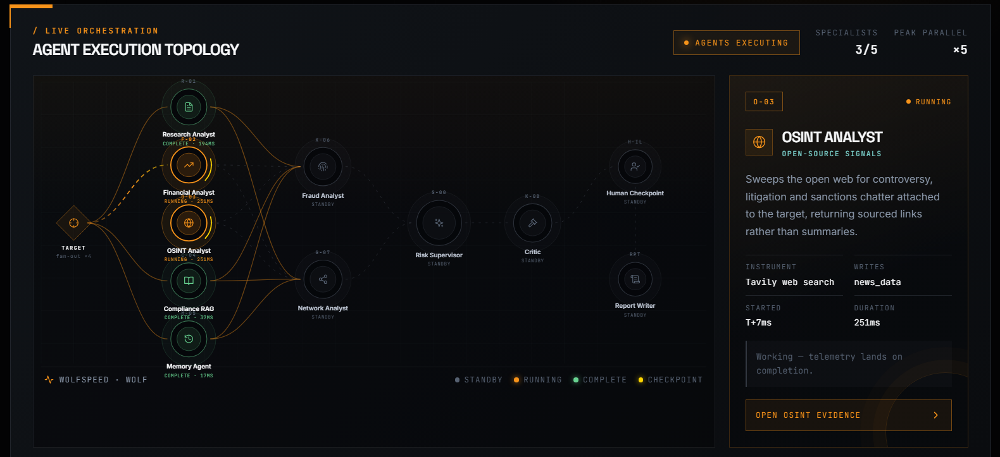
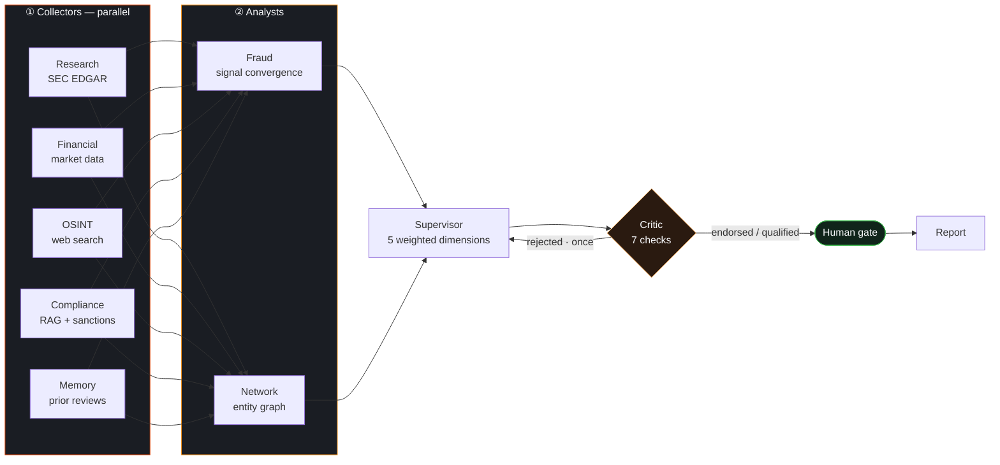
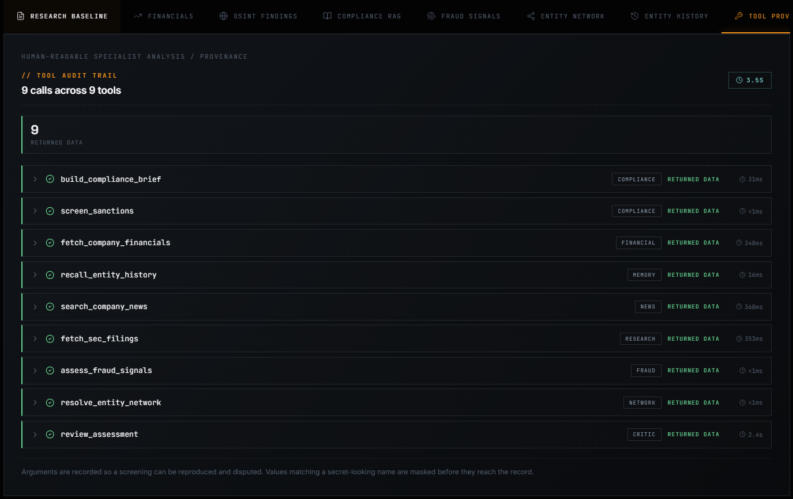
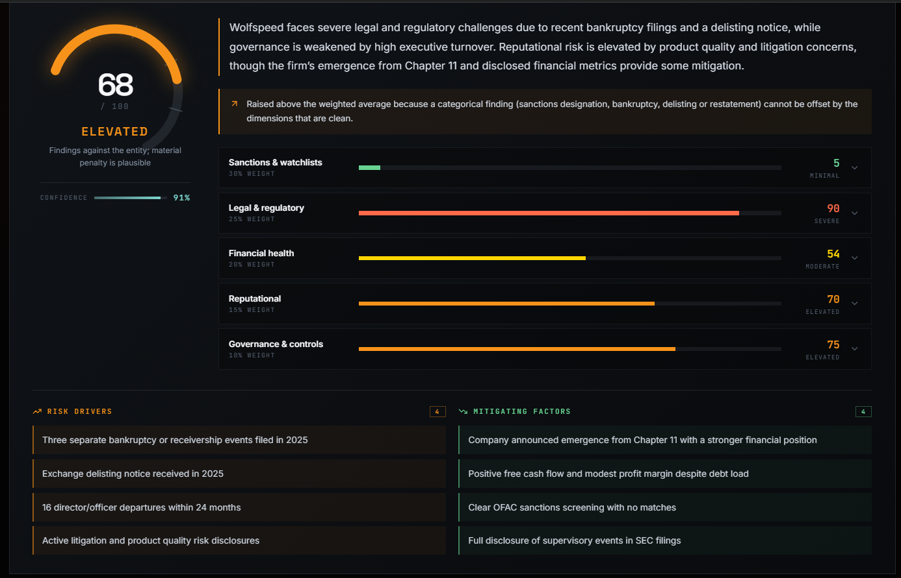
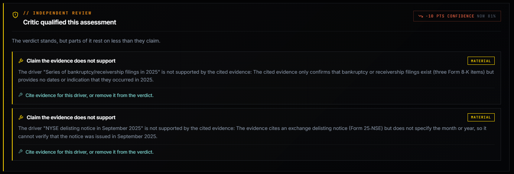

<div align="center">


**Multi-agent enterprise risk evaluation, built so every verdict can be traced to its source.**


<br>


</div>

---

## The problem

Before entering a business relationship, an organisation has to establish who it
is dealing with — sanctions exposure, regulatory filings, litigation, financial
distress. The work is slow, and it scales badly.

Handing it to a language model looks obvious and fails for one reason: **models
produce plausible statements, not verifiable ones.** Ask one to assess a company
and you get a fluent paragraph with nothing to distinguish a fact it read from a
sentence it reconstructed. In compliance that distinction is the whole job.

SENTINEL is not a better prompt. It is the system built *around* the model to
force its output to be traceable, calibrated and contestable.

---

<div align="center">

<sub><b>Five collectors in flight at once.</b> The <code>PEAK PARALLEL ×5</code> counter is
measured from the graph, not asserted — this is a real run, mid-execution.</sub>
</div>

---

## How it works

Nine agents in two tiers. Five collectors query external sources in parallel; two
analysts reason over what they returned; a supervisor composes the verdict; a
critic tries to break it before a human ever sees it.



### The three rules everything follows

<table>
<tr>
<td width="33%" valign="top">

**① Every claim cites evidence**

Each collected fact becomes an identified record. Each scored dimension cites the
record ids it rests on. The chain

`verdict → factor → evidence → tool call`

is navigable end to end — arguments included.

</td>
<td width="33%" valign="top">

**② Degradation is loud**

A missing key, an unindexed corpus, an unreachable provider — none stop the run,
all are recorded. Tools report **four** outcomes, and `EMPTY` (ran, found
nothing) is never confused with `UNAVAILABLE` (never ran).

</td>
<td width="33%" valign="top">

**③ A human decides**

The graph *interrupts* before publication. Nothing reaches the ledger until an
analyst rules on it. State is checkpointed, so the pause survives a restart.

</td>
</tr>
</table>

---

## Quickstart

> **Prerequisites** — Docker Desktop, Python 3.12+, Node 20+

```bash
git clone https://github.com/aribi-ahmed/sentinel.git
cd sentinel
```

<details open>
<summary><b>1 · Configure</b></summary>

```bash
cp .env.example .env
```

Only one key is required to run: `GROQ_API_KEY` (free tier). `TAVILY_API_KEY`
enables open-source intelligence; without it that agent reports `UNAVAILABLE`
rather than pretending it found nothing.

</details>

<details open>
<summary><b>2 · Bring up the whole stack</b></summary>

```bash
docker compose up -d --build
```

API, PostgreSQL and Redis. Check it: `curl localhost:8000/system`

</details>

<details open>
<summary><b>3 · Index the compliance corpus</b> — once, downloads a 90 MB local model</summary>

```bash
pip install -r requirements.txt
python ingest_compliance.py
```

Embeddings run locally, so retrieval costs nothing and needs no API key.

</details>

<details open>
<summary><b>4 · Start the console</b></summary>

```bash
cd sentinel-ui && npm install && npm run dev
```

Open **http://localhost:5173** and investigate `Wolfspeed / WOLF`.

</details>

<details>
<summary><b>Prefer to run the API outside Docker?</b></summary>

```bash
docker compose up -d db cache          # data services only
uvicorn sentinel.api.main:app --reload --app-dir src
```

</details>

---

## See the guarantees, don't take my word for it

<details>
<summary><b>🔍 Traceability</b> — click any claim through to the call that produced it</summary>

Open the **Tool provenance** tab after a run. Nine calls, one per agent, each
with its arguments, duration, outcome and the evidence ids it produced.
Secret-looking arguments are masked before they are recorded.

```bash
curl localhost:8000/tools     # live per-tool availability
```



</details>

<details>
<summary><b>💾 Crash resilience</b> — kill the process mid-investigation</summary>

```bash
# 1. Start an investigation; it pauses at the human gate
curl -X POST localhost:8000/investigations \
  -H 'Content-Type: application/json' \
  -d '{"subject_name":"Wolfspeed","ticker":"WOLF"}'

# 2. Kill the API outright
docker compose kill api

# 3. Bring it back
docker compose up -d api

# 4. The paused investigation is still there, with its full state
curl localhost:8000/investigations/<id>
```

State lives in PostgreSQL via the LangGraph checkpointer, not in memory.

</details>

<details>
<summary><b>⚖️ Calibration</b> — the system discriminates</summary>

| Entity | Composite | Band | Fraud | Why |
| --- | ---: | --- | ---: | --- |
| Alphabet | 25 | LOW | 0 | Ordinary exposure, healthy issuer |
| Tesla | 25.5 | LOW | 12 | Real litigation, no reporting failure |
| Wolfspeed | 67.5 | **ELEVATED** | 92 | Chapter 11, delisting, accelerated debt |
| Rosneft | >60 | **ELEVATED** | — | Designated entity |

An early version returned ELEVATED for *everything*. A system that flags
everything is as useless as one that flags nothing.



</details>

<details>
<summary><b>⚖️ The critic contests the verdict</b> — six deterministic checks plus one narrow model question</summary>

Six checks read the assessment, the evidence pool and the tool audit trail and
either find a defect or do not — no model is asked whether the verdict is sound,
because a model asked that returns plausible commentary either way.

The seventh is model-judged and anchored: *which stated drivers does the cited
evidence fail to support?* Its answers are matched back against the assessment's
own driver list, so it cannot object to a claim the verdict never made.



A rejected verdict returns to the supervisor **once**. An unresolved rejection
still reaches the analyst, carrying its objections — suppressing a verdict the
system cannot fix would hide the disagreement rather than surface it.

</details>

<details>
<summary><b>🔌 Provider independence</b> — the same investigation on two providers</summary>

```bash
python scripts/verify_m01.py                  # one prompt on each provider
python scripts/verify_m01.py --investigation  # a full investigation on each
```

Swapping providers is a single environment variable, `LLM_PROVIDER`. Wolfspeed
scores **67.5 ELEVATED on both Groq and Hugging Face**. The script also kills the
primary and watches the fallback take over.

`GET /system` reports which providers are live and — via `by_provider` — which
one actually served the traffic, rather than which was configured.

</details>

<details>
<summary><b>🧪 Regression testing on agent behaviour</b></summary>

```bash
pytest -m "not integration"            # 478 tests, no network, no DB
python -m sentinel.evaluation          # 10 live cases, end to end
python -m sentinel.evaluation --fail-on-regression   # for CI
```

Ten golden investigations run against real sources, each scored on 14–21
**deterministic** checks. No model judges another model, so the harness cannot
hallucinate a pass. Current baseline: **10/10 cases, 179/179 checks**, ~81s,
~$0.003.

Every case exists because something once broke — over-flagging, under-flagging,
a false positive on `ALPHABET INTERNATIONAL DMCC`, a degenerate empty request.

</details>

---

## Architecture

Concentric layers, dependencies pointing inward. The rule is **enforced, not
documented**: `tests/unit/test_architecture.py` parses every module with `ast`
and fails when a framework leaks into the wrong layer.

```
sentinel/
├── domain/          ← standard library only. No SQLAlchemy, no FastAPI, no LangGraph.
├── repositories/    ← Protocols; SQL and in-memory implementations
├── services/        ← scoring · critic · fraud · knowledge graph · memory
├── llm/             ← provider gateway (only 2 files import a provider SDK)
├── tools/           ← registry: one call path, one audit record
├── graph/           ← LangGraph nodes, state channels, checkpointer
└── api/             ← FastAPI + SSE streaming
```

That test has caught two real defects by itself — a retired prototype violating
the provider boundary, and two dead agent modules, one of which had stopped being
importable months earlier.

**Eleven decisions** are recorded in [`docs/adr/`](docs/adr/), each naming the
alternatives rejected and why. The design rationale lives in
[`docs/architecture.md`](docs/architecture.md).

---

## Objectives

| # | Objective | Status |
| --- | --- | --- |
| M-01 | Provider-agnostic LLM gateway | ✅ Groq + Hugging Face, same verdict on both |
| M-02 | LangGraph supervisor orchestration | ✅ conditional routing, every decision logged |
| M-03 | Specialist agents | ✅ nine agents across two tiers |
| M-04 | Typed tool registry | ✅ nine tools, every call audited |
| M-05 | Retrieval with citations | ✅ resolved by passage index, not self-report |
| M-06 | Human-in-the-loop gate | ✅ |
| M-07 | Explainable weighted scoring | ✅ 2 of 5 dimensions never touch a model |
| M-08 | REST API over the lifecycle | ✅ 11 endpoints, 2 streaming |
| M-09 | PostgreSQL + Redis | ✅ |
| M-10 | Checkpointing and resumability | ✅ verified by kill/restart |
| M-11 | One-command containerization | ✅ |
| M-12 | Tests and documentation | ✅ 478 tests · 11 ADRs · golden dataset |

**Not built, named honestly:** relationship data beyond what retrieved sources
disclose (no corporate-registry feed, so beneficial ownership is out of reach),
and semantic recall — entity history matches on normalised name or exact ticker,
not on meaning.

---

## Data sources

| Source | Key | Used for |
| --- | --- | --- |
| SEC EDGAR | none | Filing history; restatements, bankruptcies, delistings |
| OFAC SDN | none | Screening against 19,199 designated entries |
| DOJ ECCP · SEC Enforcement Manual · NIST CSF 2.0 | none | The compliance corpus |
| yfinance | none | Market metrics |
| Groq | free tier | Model inference |
| Tavily | free tier | Open-source intelligence |
| OpenSanctions | optional | EU/UN/UK lists and PEP data |

---

<div align="center">

## Author

**Ahmed Aribi** — Software Engineering (GL2), INSAT
AI Engineer Intern @ **Welyne**

Built over six weeks. 9,797 lines of source, 3,140 lines of tests,
10 architecture decisions, 12 documented defects found and fixed.

<br>

[](https://aribi-ahmed.vercel.app)
[](https://www.linkedin.com/in/ahmed-aribi/)
[](https://github.com/aribi-ahmed)

<br>

<sub>MIT licensed · Advisory software: every verdict requires human review.<br>Built as a learning project — not for processing real personal data.</sub>

</div>
